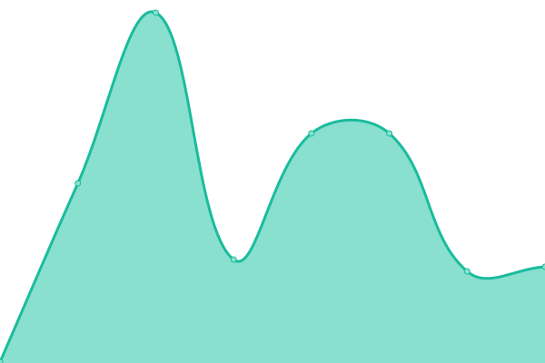
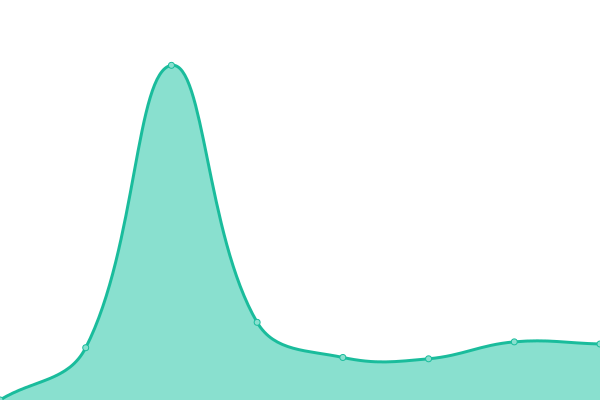
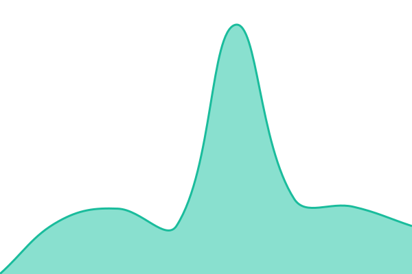

# [📈 Live Status](https://a64.work): <!--live status--> **🟧 Partial outage**

This repository contains the open-source uptime monitor and status page for [Sheng Wang](https://a64.work), powered by [Upptime](https://github.com/upptime/upptime).

With [Upptime](https://upptime.js.org), you can get your own unlimited and free uptime monitor and status page, powered entirely by a GitHub repository. We use [Issues](https://github.com/wakira/my-upptime/issues) as incident reports, [Actions](https://github.com/wakira/my-upptime/actions) as uptime monitors, and [Pages](https://a64.work) for the status page.

<!--start: status pages-->
<!-- This summary is generated by Upptime (https://github.com/upptime/upptime) -->
<!-- Do not edit this manually, your changes will be overwritten -->
<!-- prettier-ignore -->
| URL | Status | History | Response Time | Uptime |
| --- | ------ | ------- | ------------- | ------ |
|  [Blog](https://a64.work) | 🟩 Up | [blog.yml](https://github.com/wakira/my-upptime/commits/HEAD/history/blog.yml) | 

 255ms
     
 | 

<a href="https://status.a64.work/history/blog">100.00%</a>
    

|  [Matrix Synapse](https://matrix.a64.work) | 🟥 Down | [matrix-synapse.yml](https://github.com/wakira/my-upptime/commits/HEAD/history/matrix-synapse.yml) | 

 1481ms
     
 | 

<a href="https://status.a64.work/history/matrix-synapse">99.90%</a>
    

|  [Librephotos](https://photos.a64.work) | 🟥 Down | [librephotos.yml](https://github.com/wakira/my-upptime/commits/HEAD/history/librephotos.yml) | 

 461ms
     
 | 

<a href="https://status.a64.work/history/librephotos">99.95%</a>
    

<!--end: status pages-->

[**Visit our status website →**](https://a64.work)

## 📄 License

- Powered by: [Upptime](https://github.com/upptime/upptime)
- Code: [MIT](./LICENSE) © [Sheng Wang](https://a64.work)
- Data in the `./history` directory: [Open Database License](https://opendatacommons.org/licenses/odbl/1-0/)
